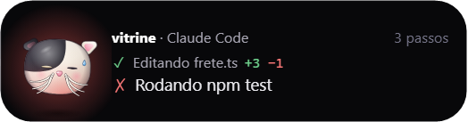
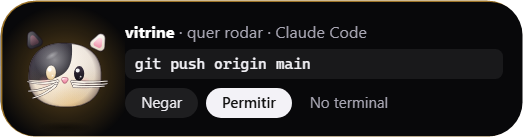
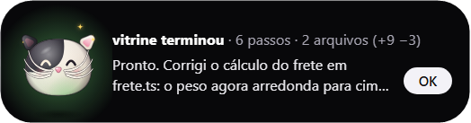
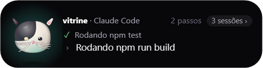
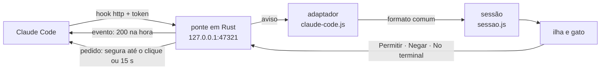
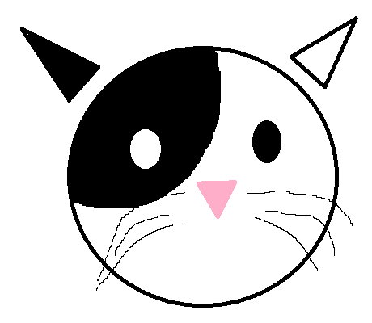
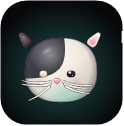

<div align="center">



# Xereta

**Um gato frajola mora no topo da sua tela e fica de olho no Claude Code por você.**

Ele conta o que o agente está fazendo, quanto mudou em cada arquivo e como a sessão terminou,
e deixa você dizer *pode* ou *não* para um pedido de permissão sem voltar ao terminal.


</div>

> **xe·re·ta** *(adj. e s. 2g., bras.)* — quem mete o nariz onde não foi chamado.
> Este foi chamado.

---

## Um turno de trabalho, visto do topo da tela

Você pede *"corrige o cálculo do frete e roda os testes"* e vai ler outra coisa. A pílula
fica lá em cima, do tamanho de um notificador, e vai contando.

<table>
<tr>
<td width="56%"></td>
<td><b>Passe o mouse e ela abre.</b> O passo de antes e o de agora, o <code>+3 −1</code> de cada edição (contado do patch que o Claude Code de fato gravou) e o ✗ do teste que falhou. O gato fica com a cara de quem viu.</td>
</tr>
<tr>
<td></td>
<td><b>Na hora do <code>git push</code>, ela pede licença.</b> Abre sozinha, fica âmbar e mostra o comando inteiro. Você responde dali, sem mudar de janela, e ela nunca rouba o foco de quem está digitando. O terminal pergunta junto, e vale quem responder primeiro.</td>
</tr>
<tr>
<td></td>
<td><b>Terminou?</b> A ilha abre com o resumo da sessão e o começo do que o Claude disse no fim, sem o Markdown. Fica aberta até você dar OK, para quem estava longe da tela ainda encontrar o resultado.</td>
</tr>
<tr>
<td></td>
<td><b>Mais de uma sessão?</b> Ela mostra a que mudou por último, e um clique em <i>3 sessões ›</i> passa para a próxima. Fechar o terminal de uma sessão tira ela da conta na hora.</td>
</tr>
</table>

---

## O que o gato nunca faz

O Xereta tem poder de dizer *pode* a um agente que roda comandos na sua máquina. Por isso ele
vem com limites que não dependem de boa vontade: estão no código e têm teste.

| Nunca | Como isso é garantido |
|---|---|
| **diz *pode* por você** | Sem clique em 15 s, o pedido volta para o terminal. Nenhum caminho de erro, de prazo ou de conexão fechada devolve `allow`, e há teste para cada um. A pergunta do Claude (escolher uma opção) nem vira pedido: ela segue no terminal, e a ilha só avisa. |
| **atrasa o Claude Code** | Status responde em 2–5 ms. Com o app fechado, a conexão é recusada na hora (3–17 ms por hook, medido), e tudo volta a ser como era antes do Xereta. |
| **rouba o foco ou o clique** | A janela não aceita foco e é recortada na forma da ilha: fora dela, o clique cai no app de trás. |
| **leva o que viu para o disco** | O que as ferramentas recebem, a mensagem final e os nomes de arquivo ficam só na memória da página. Um `.env` editado não vira log. |
| **sai da sua máquina** | Escuta só em `127.0.0.1`, com um token de 32 bytes conferido em tempo constante antes de ler o corpo. Não fala com nenhum servidor. |
| **mexe no seu `settings.json` sem você ver** | O instalador dos hooks mostra a prévia (com o token mascarado), faz backup com data, grava de forma atômica e recusa se o arquivo mudou desde a prévia. Os seus outros hooks não são tocados. |

---

## Como ele espia



- **Hooks `http` direto para o app**, sem script no meio: nenhum processo extra a cada evento.
  São oito (`UserPromptSubmit`, `PreToolUse`, `PostToolUse`, `PostToolUseFailure`,
  `PermissionRequest`, `Stop`, `StopFailure` e `SessionEnd`).
- **O Rust é fino.** Recebe o HTTP, confere token e tamanho, repassa à página e devolve a
  decisão. Ele não sabe o que é o Claude Code: toda regra mora em JS.
- **Cada fonte é um adaptador** que traduz o que ela manda para um formato comum. Hoje existe o
  do Claude Code; Codex, Gemini CLI e os seus próprios scripts entram como arquivos novos.
- **Cada pedido sabe de qual ferramenta é.** O `PermissionRequest` não traz id, então a ponte o
  liga ao `PreToolUse` da mesma chamada. Com várias ferramentas pedidas de uma vez, a ilha e o
  terminal mostram a mesma coisa, e responder uma não solta as outras.
- **O gato é Canvas 2D com molas**, em camadas de gradiente, a 15 quadros por segundo na pílula
  (para a memória ficar plana) e até 60 com a ilha aberta.

---

## Pôr o gato para trabalhar

Ainda não há instalador publicado: por enquanto, o Xereta roda a partir do código.

**Precisa de:** Windows 10 ou 11, com
[Rust](https://rustup.rs) estável (testado com 1.99, `stable-x86_64-pc-windows-msvc`), as
**Build Tools do Visual Studio 2022** com "Desenvolvimento para desktop com C++" (só o compilador
e o linker), [Node.js](https://nodejs.org) 20 ou mais novo e o WebView2 (já vem no Windows 11).

```powershell
git clone https://github.com/Vinicius-Santos234/xereta.git
cd xereta
npm install
npm run tauri dev          # abre a ilha; a primeira compilação leva uns 5 minutos
```

Com a ilha aberta, ligue o Claude Code a ela:

```powershell
npm run hooks -- instalar  # mostra exatamente o que muda, pergunta, faz backup e grava
npm run hooks -- estado    # ligado, desligado ou diferente
npm run hooks -- remover   # devolve o settings.json como era
```

O Claude Code recarrega os hooks sozinho, inclusive nas sessões já abertas.

**Instalador:** `npm run tauri build` gera o NSIS e o MSI em `src-tauri\target\release\bundle\`
(cerca de 1,4 MiB, por usuário, sem pedir administrador). Ele ainda não é assinado, e o Windows
Defender pode reclamar.

**Testes:** `npm test` (95, em JS) e `cargo test` dentro de `src-tauri` (28, em Rust).

<details>
<summary><b>Configuração e o token</b></summary>

Na primeira vez, o app cria `%APPDATA%\app.xereta.ilha\config.json`:

```json
{ "porta": 47321, "token": "<64 caracteres hexadecimais>", "esperaPedidoSegundos": 15 }
```

O token tem 32 bytes do gerador do sistema. **Não mostre esse arquivo nem o seu `settings.json`
em prints:** com o token, outro programa da sua máquina conseguiria responder pedidos no seu
lugar. Uma porta ocupada aparece como erro na própria ilha, e o Xereta **não** troca de porta
sozinho, porque os hooks apontam para uma porta fixa.

</details>

<details>
<summary><b>Testar a ponte sem o Claude Code</b></summary>

Com o app aberto, mande um evento como se fosse um hook:

```powershell
$cfg = Get-Content "$env:APPDATA\app.xereta.ilha\config.json" | ConvertFrom-Json
$corpo = @{ hook_event_name = 'PreToolUse'; session_id = 'teste'; cwd = 'C:\projetos\vitrine'
            tool_name = 'Bash'; tool_use_id = 't1'; tool_input = @{ command = 'npm test' } } | ConvertTo-Json
Invoke-RestMethod -Method Post -Uri "http://127.0.0.1:$($cfg.porta)/fontes/claude-code/evento" `
  -Headers @{ Authorization = "Bearer $($cfg.token)" } -ContentType 'application/json' -Body $corpo
```

A ilha mostra "vitrine · Claude Code · Rodando npm test". Trocando `evento` por `pedido` e o
`hook_event_name` por `PermissionRequest`, a chamada fica esperando até você responder pelos
botões da ilha (ou até 15 s).

| Rota | Resposta |
|---|---|
| `POST /fontes/<fonte>/evento` | `200` vazio na hora |
| `POST /fontes/<fonte>/pedido` | Aberta até a decisão; sem decisão em 15 s, `200` vazio |
| Sem token ou token errado | `401` |
| Corpo > 10 MB · sem `Content-Length` · outra rota · outro método | `413` · `411` · `404` · `405` |

Limites contra abuso: cabeçalho de até 16 KB, requisição inteira em até 10 s, até 64 conexões e
32 pedidos abertos. A interface roda com CSP restritiva e só com as permissões do Tauri que o
código usa.

</details>

---

## O que já sabe fazer

| Etapa | O quê | Medido |
|---|---|---|
| **MVP** ✅ | A ilha, o gato, o status ao vivo e a permissão pela ilha ([spec 001](specs/001-mvp.md)) | 84,7 MB de média parada (5 min) · instalador de 1,37 MiB |
| **Cartão da sessão** ✅ | Passos, `+N −M` de cada edição e a mensagem final com OK ([002 F1](specs/002-sessao-na-ilha.md)) | `+N −M` igual ao `git diff`, também com `replace_all` e Write por cima |
| **Várias sessões** ✅ | A que mudou por último na tela, "N sessões ›" para trocar ([002 F2](specs/002-sessao-na-ilha.md)) | Fechar o terminal tira da conta na hora |

Da E1 em diante, cada etapa passou por teste na mão com sessões reais e por uma revisão do Codex,
só de leitura. O que cada uma achou, e como foi corrigido, está na própria spec.

## Para onde ele vai

| Spec | O que é | Estado |
|---|---|---|
| [002 — A ilha conta a sessão](specs/002-sessao-na-ilha.md) | Falta a linha do tempo e a personalidade do gato: selo de estado na orelha, cochilo, caneca de café na maratona, ronronar e a patadinha no cursor | Em andamento |
| [003 — Decidir com confiança](specs/003-decidir-com-confianca.md) | **O diff no próprio pedido**, antes do Permitir; o risco do comando, com o gato desconfiado; "sempre permitir" com a regra à vista | Rascunho |
| [004 — Responder ao Claude](specs/004-responder-ao-claude.md) | As perguntas de múltipla escolha respondidas pela ilha | Rascunho |
| [005 — Configurações e conforto](specs/005-configuracoes-e-conforto.md) | Sair da frente em tela cheia, modo foco, modo apresentação, sons, iniciar com o Windows | Rascunho |
| [006 — Várias fontes](specs/006-varias-fontes.md) | `xereta "Build OK"` para os seus scripts; Codex, Gemini CLI e Ollama | Rascunho |

O projeto anda por specs: cada uma tem decisões numeradas, etapas com critérios de aceite e um
bloco datado com o que foi medido. [`ideias/`](ideias/) guarda os documentos vivos (diferenciais,
o mascote e o estudo do concorrente).

---

## De onde ele veio

<table>
<tr>
<td align="center" width="50%"><br><sub>o esboço, 02/10</sub></td>
<td align="center" width="50%"><br><sub>o gato, em Canvas 2D com molas</sub></td>
</tr>
</table>

O Xereta nasceu de um reel do [Coucou](https://github.com/Louis-CFM/coucou), de Louis Raillé: um
mascote no topo da tela que acompanha o Claude Code. O repositório dele foi material de estudo, e
nenhum código foi copiado; o Mochi e o nome Coucou são dele.

O nosso é outro bicho: **Windows de primeira**, **português desde a primeira linha** (o gato diz
"Opa, cheguei!", "Bora!", "Deu ruim…" e "Prontinho!") e um rumo próprio, o de **decidir bem**: o
diff no próprio pedido, antes do Permitir, e o risco do comando à vista. É a próxima spec grande.
*Xereta* é um nome provisório.

---

## Por dentro

```
src/                      a interface, em JavaScript puro
  ilha.js, ilha.css, index.html   a ilha, os botões, a bandeja e o recorte da janela
  ponte.js                        recebe os avisos da ponte, liga cada pedido à sua ferramenta
  sessao.js                       a sessão contada: passos, +N −M por arquivo, o fim, as sessões
  adaptadores/claude-code.js      hooks do Claude Code → formato comum (e a resposta)
  mascote/gato.js                 o gato: Canvas 2D, molas e volume em camadas
  textos/pt-BR.js                 todos os textos do app, num arquivo só
src-tauri/src/            o núcleo em Rust: ponte HTTP, config, recorte e a janela do terminal
scripts/hooks.js          o instalador dos hooks
design/                   o esboço e o protótipo do gato, com todos os estados lado a lado
specs/ · ideias/          o que construir e por quê
```

Quer mexer? O [`AGENTS.md`](AGENTS.md) tem as regras do projeto, para gente e para agente.

---

## Licença

- **Código:** [MIT](LICENSE). Use, estude, modifique e redistribua.
- **Nome, gato, ícone e sons:** reservados ([`LICENSE-ASSETS.md`](LICENSE-ASSETS.md)). Um fork
  pode ser publicado, desde que com nome e personagem próprios.

<div align="center"><sub>Feito no Brasil por Vinicius Gonçalves Oliveira Santos, com o Claude Code de olho no gato que fica de olho nele.</sub></div>
